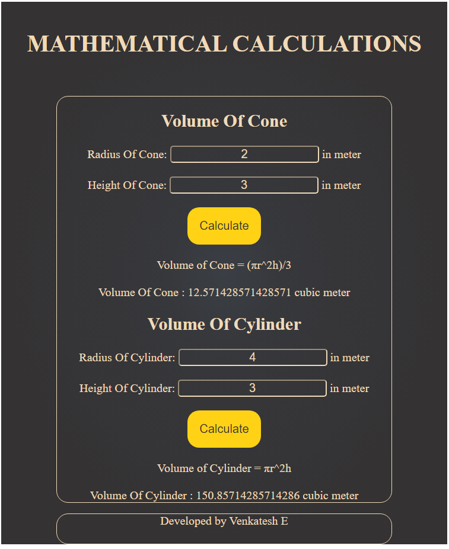
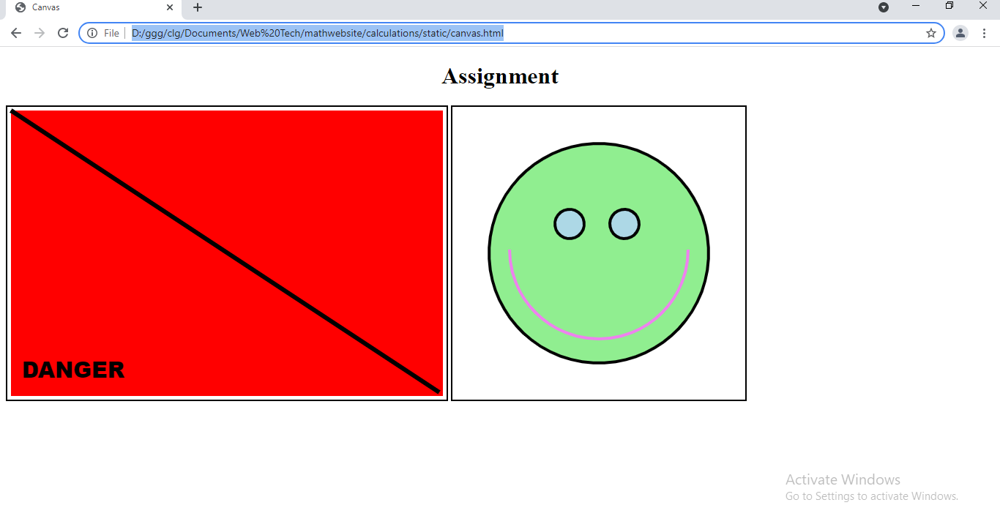

# Web Page for Mathematical Calculations

## AIM:

To design a static website with validation to perform mathematical calculations in client side.

## DESIGN STEPS:

### Step 1:

Requirement collection.

### Step 2:

Creating the layout using HTML and CSS.

### Step 3:

Write javascript to perform the calculations.

### Step 4:

Include regularexpression based input validation.

### Step 5:

Validate the layout in various browsers.

### Step 6:

Validate the HTML code.

### Step 6:

Publish the website in the given URL.

## PROGRAM :
### CSS :
~~~
.header {
    width: auto;
    margin-left: auto;
    margin-right: auto;
    border-width: 0px 0px 0px 0px;
    border-style: none;
    background-color: transparent;
    height: auto;
    text-align: center;
    font-size: 20px;
    border: none;
    padding: 20px;
}

.hhh {
    text-align: center;
}

button {
    font-size: 20px;
    background-color: #ffd215;
    color: #343233;
    border: none;
    cursor: pointer;
    text-align: center;
    display: inline-flex;
    border-radius: 20px;
    padding: 20px;
}

.u {
    text-align: center;
}

.container {
    width: 75%;
    margin-left: auto;
    margin-right: auto;
    border-width: 1px 1px 1px 1px;
    border-style: solid;
    border: 1px solid;
    background-color: transparent;
    height: auto;
    text-align: center;
    font-size: 20px;
    border-radius: 20px;
}

.footer {
    width: 75%;
    margin-left: auto;
    margin-right: auto;
    border-width: 1px 1px 1px 1px;
    border-style: solid;
    border: 1px solid;
    background-color: transparent;
    height: auto;
    text-align: center;
    font-size: 20px;
    height: 50px;
    border-radius: 20px;
}

.t {
    background-image: radial-gradient(ellipse closest-side at 50% 50%, #3a3f45, #37383c 25%, #343233);
    color: #efdab9;
    height: 100%;
}

input {
    background-color: transparent;
    font-size: 20px;
    border-radius: 5px;
    border-color: #efdab9;
    color: #efdab9;
    text-align: center;
}
~~~
### HTML :
~~~
<!DOCTYPE html>
<html lang="en">

<head>
    <meta charset="UTF-8" />
    <meta http-equiv="X-UA-Compatible" content="IE=edge" />
    <meta name="viewport" content="width=device-width, initial-scale=1.0" />
    <link rel="stylesheet" href="./css/layout1.css" />
    <title>Mathematical Calculations</title>
    
</head>

<body>
    

        

            <h1>MATHEMATICAL CALCULATIONS</h1>
        
 
        

            

                <h2 class="hhh">Volume Of Cone</h2>
                <label for="radcone">Radius Of Cone:</label>
                <input type="text" name="radcone" id="radcone"><label> in meter</label>  
                <label for="heightcone">Height Of Cone:</label>
                <input type="text" name="heightcone" id="heightcone"><label> in meter</label>  
                <button type="button" onclick="volcone()">Calculate</button>  
                <label class="u">Volume of Cone = (πr^2h)/3</label>  
                <label class="u" id="vol_cone"></label>
            

            

                <h2 class="hhh">Volume Of Cylinder</h2>
                <label for="radcylinder">Radius Of Cylinder:</label>
                <input type="text" name="radcylinder" id="radcylinder"> <label>  in meter</label>  
                <label for="heightcylinder">Height Of Cylinder:</label>
                <input type="text" name="heightcylinder" id="heightcylinder"><label>  in meter</label>  
                <button class="f" type="button" onclick="volcylinder()">Calculate</button>  
                <label class="u">Volume of Cylinder = πr^2h</label>  
                <label class="u" id="vol_cylinder"></label>
            

        
 
        
Developed by Venkatesh E

    

</body>

</html>
~~~
## OUTPUT:

## Result:

Thus a website is designed to perform mathematical calculations in the client side.
# HTML Canvas Experiment:
## Program:
~~~
<!DOCTYPE html>
<html>
<title>Canvas</title>

<body>
    <h1 style="text-align: center;">Assignment</h1>
    <canvas id="mycanvas" width="600px" height="400px" style="border:2px solid #000000">
        </canvas>
    

    <canvas id="canvas" width="400px" height="400px" style="border:2px solid #000000">
        </canvas>
    
</body>

</html>
~~~
## Output:

## Result:

Thus a website is designed with Canvas
